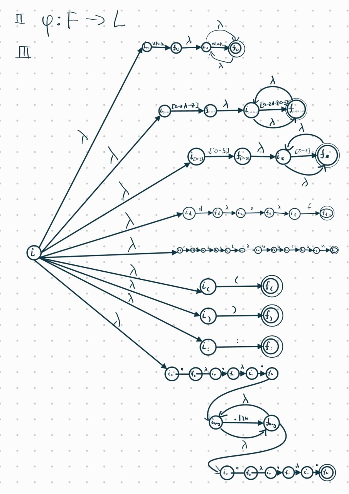
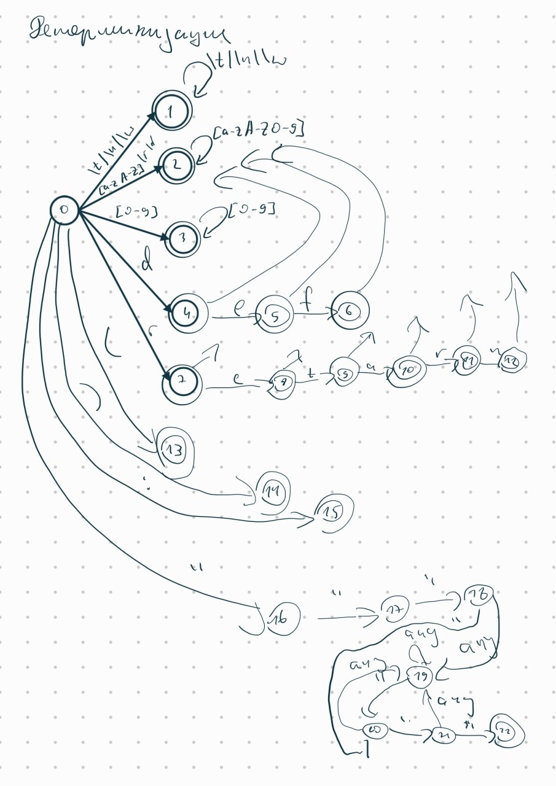

% Лабораторная работа № 1.4 «Лексический распознаватель»
% 7 мая 2025 г.
% Александр Старовойтов, ИУ9-61Б

# Цель работы

Целью данной работы является изучение использования детерминированных конечных
автоматов с размеченными заключительными состояниями (лексических
распознавателей) для решения задачи лексического анализа.

# Индивидуальный вариант

def, return, (, ), :, комментарии ограничены знаками """, могут пересекать
границы строк текста.

# Реализация

Лексическая структура языка — регулярные выражения для доменов:

- `\s+`
- `[a-zA-Z][a-zA-Z0-9]*`
- `[0-9]+`
- `def`
- `return`
- `\(`
- `\)`
- `:`
- `\"\"\"(?:.|\n)*\"\"\"`

Граф недетерминированного распознавателя:



Граф детерминированного распознавателя:



Реализация распознавателя:

Файл `lexer.clj`:
```clojure
(ns lab5.lexer
  (:gen-class)
  (:require [clojure.string :as str]
            [lab5.models.token :refer :all]))

(defn alnum-exclude-character [character]
  #(and (not= character %)
        (Character/isLetterOrDigit %)))

(def character-classes [(list #(str/includes? "\t\n " (str %))
                              '(0 1)
                              '(1 1))
                        (list #(and (Character/isLetter %)
                                    (not (str/includes? "rd" (str %))))
                              '(0 2))
                        (list #(Character/isLetterOrDigit %)
                              '(2 2)
                              '(12 2)
                              '(6 2))
                        (list #(Character/isDigit %)
                              '(0 3)
                              '(3 3))
                        (list #(= \d %)
                              '(0 4))
                        (list #(= \e %)
                              '(7 8)
                              '(4 5))
                        (list (alnum-exclude-character \e)
                              '(4 2)
                              '(7 2))
                        (list #(= \f %)
                              '(5 6))
                        (list (alnum-exclude-character \f)
                              '(5 2))
                        (list #(= \t %)
                              '(8 9))
                        (list (alnum-exclude-character \t)
                              '(8 2))
                        (list #(= \u %)
                              '(9 10))
                        (list (alnum-exclude-character \u)
                              '(9 2))
                        (list #(= \r %)
                              '(0 7)
                              '(10 11))
                        (list (alnum-exclude-character \r)
                              '(10 2))
                        (list #(= \n %)
                              '(11 12))
                        (list (alnum-exclude-character \n)
                              '(11 2))
                        (list #(= \( %)
                              '(0 13))
                        (list #(= \) %)
                              '(0 14))
                        (list #(= \: %)
                              '(0 15))
                        (list #(= \" %)
                              '(0 16)
                              '(16 17)
                              '(17 18)
                              '(18 20)
                              '(19 20)
                              '(20 21)
                              '(21 22))
                        (list #(not= \" %)
                              '(18 19)
                              '(19 19)
                              '(20 19)
                              '(21 19))])

(def state-to-lexem-class {1 :WS
                           2 :IDENT
                           3 :INT
                           4 :IDENT
                           5 :IDENT
                           6 :DEF
                           7 :IDENT
                           8 :IDENT
                           9 :IDENT
                           10 :IDENT
                           11 :IDENT
                           12 :RETURN
                           13 :LPAREN
                           14 :RPAREN
                           15 :COLON
                           22 :COMMENT
                           })

(defn get-character-classes [character]
  (->> (map-indexed (fn [index class]
                      (if ((first class) character)
                        index
                        nil))
                    character-classes)
       (filter #(not (nil? %)))))

(def transitions (loop [transitions
(into [] (repeat 22 (into [] (repeat (count character-classes) -1))))
                        classes (seq character-classes)
                        i 0]
                   (if (empty? classes)
                     transitions
                     (recur (loop [transitions transitions
                                   edges (rest (first classes))]
                              (if (empty? edges)
                                transitions
                                (recur (assoc-in transitions
                                                 [(first (first edges)) i]
                                                 (first (rest (first edges))))
                                       (rest edges))))
                            (rest classes)
                            (+ i 1)))))

(defn make-transition [state character]
  (let [state-transitions (get transitions state)
        transition-list (->> (get-character-classes character)
                             (map (fn [index] (get state-transitions index)))
                             (filter #(not= % -1)))]
    (if (empty? transition-list)
      nil
      (first transition-list))))

(defn is-final? [state]
  (not (nil? (get state-to-lexem-class state))))

(defn spymy
  "Print + Return"
  [x]
  (prn x)
  x)

(defn coords [start end]
  (->Coordinates (->Position (first start) (first (rest start)))
                 (->Position (first end) (first (rest end)))))

(defn get-token [state image start end]
  (->Token (state-to-lexem-class state)
           (str/join (reverse image))
           (->Coordinates start end)))

(defn next-position [pos character]
  (if (= \newline character)
    (->Position (+ 1 (get pos :line))
                1)
    (->Position (get pos :line)
                (+ 1 (get pos :column)))))

(defn format-position [pos]
  (format "%d:%d"
          (get pos :line)
          (get pos :column)))

(defn format-coords [coords]
  (format "(%s-%s)"
          (format-position (get coords :start))
          (format-position (get coords :end))))

(defn format-token [token]
  (format "%s %s: %s"
          (get token :class)
          (format-coords (get token :coords))
          (get token :image)))

(defn tokenize-internal
  [text]
  (loop [state 0
         final nil
         image '()
         characters (seq text)
         start (->Position 1 1)
         end nil
         current (->Position 1 1)
         tokens '()
         messages '()]
    (if (empty? characters)
      (if (nil? final)
        (list tokens messages current)
        (list (cons (get-token final image start end) tokens)
              messages
              current))
      (let [character (first characters)
            new-state (make-transition state character)]
        (condp = (list new-state final)
          (list nil nil) (recur state
                                final
                                image
                                (rest characters)
                                (next-position current character)
                                nil
                                (next-position current character)
                                tokens
                                (cons (format "unexpected symbol %c at %s"
                                character (format-position current)) messages))
          (list nil final) (recur 0
                                  nil
                                  '()
                                  characters
                                  current
                                  end
                                  current
                                  (cons (get-token final image start end) tokens)
                                  messages)
          (list new-state final) (if (is-final? new-state)
                                   (recur new-state
                                          new-state
                                          (cons character image)
                                          (rest characters)
                                          start
                                          current
                                          (next-position current character)
                                          tokens
                                          messages)
                                   (recur new-state
                                          final
                                          (cons character image)
                                          (rest characters)
                                          start
                                          end
                                          (next-position current character)
                                          tokens
                                          messages)))))))

(defn tokenize [text]
  (let [tmp (tokenize-internal text)
        tokens (first tmp)
        messages (first (rest tmp))
        end (first (rest (rest tmp)))]
    (list (reverse
           (cons (->Token :EOF "" (->Coordinates end end))
                 (filter #(not= (get % :class) :WS)
                         tokens)))
          messages)))

(defn -main
  [& _]
  (let [input (slurp *in*)
        out (tokenize input)
        tokens (first out)
        messages (first (rest out))]
    (println (str/join "\n" messages))
    (println (->> (map #(format-token %) tokens)
                  (str/join "\n")))))
```

Файл `models/token.clj`:
```clojure
(ns lab5.models.token)

(defrecord Token [class image coords])

(defrecord Coordinates [start end])

(defrecord Position [line column])
```

# Тестирование

```clojure
(ns lab5.lexer-test
  (:require [clojure.test :refer :all]
            [lab5.lexer :refer :all]
            [lab5.models.token :refer :all]))

(defn spy
  "Print + Return"
  [x]
  (prn x)
  x)

(deftest tokenize-test
  (let [got (tokenize-internal "123")]
    (is (= got (list (list (->Token :INT "123" (coords '(1 1) '(1 3))))
                     '()
                     (->Position 1 4))))))

(deftest get-character-class-test
  (let [got (get-character-classes \a)]
    (is (= got (list 1 2 6 8 10 12 14 16 21)))))

(deftest tokenize-internal-simple-text-test
  (let [got (tokenize-internal "123 a1 def return1: (oaoa)")]
    (is (= got (list (reverse (list (->Token :INT "123" (coords '(1 1) '(1 3)))
                                    (->Token :WS " " (coords '(1 4) '(1 4)))
                                    (->Token :IDENT "a1" (coords '(1 5) '(1 6)))
                                    (->Token :WS " " (coords '(1 7) '(1 7)))
                                    (->Token :DEF "def" (coords '(1 8) '(1 10)))
                                    (->Token :WS " " (coords '(1 11) '(1 11)))
                                    (->Token :IDENT "return1" (coords '(1 12) '(1 18)))
                                    (->Token :COLON ":" (coords '(1 19) '(1 19)))
                                    (->Token :WS " " (coords '(1 20) '(1 20)))
                                    (->Token :LPAREN "(" (coords '(1 21) '(1 21)))
                                    (->Token :IDENT "oaoa" (coords '(1 22) '(1 25)))
                                    (->Token :RPAREN ")" (coords '(1 26) '(1 26)))))
                     '()
                     (->Position 1 27))))))

(deftest tokenize-simple-text-test
  (let [got (tokenize "123 a1 def return1: (oaoa)")]
    (is (= got (list (list (->Token :INT "123" (coords '(1 1) '(1 3)))
                           (->Token :IDENT "a1" (coords '(1 5) '(1 6)))
                           (->Token :DEF "def" (coords '(1 8) '(1 10)))
                           (->Token :IDENT "return1" (coords '(1 12) '(1 18)))
                           (->Token :COLON ":" (coords '(1 19) '(1 19)))
                           (->Token :LPAREN "(" (coords '(1 21) '(1 21)))
                           (->Token :IDENT "oaoa" (coords '(1 22) '(1 25)))
                           (->Token :RPAREN ")" (coords '(1 26) '(1 26)))
                           (->Token :EOF "" (coords '(1 27) '(1 27))))
                     '())))))

(deftest tokenize-lines-test
  (let [got (tokenize "123\n  321  \n   oa  ")]
    (is (= got (list (list (->Token :INT "123" (coords '(1 1) '(1 3)))
                           (->Token :INT "321" (coords '(2 3) '(2 5)))
                           (->Token :IDENT "oa" (coords '(3 4) '(3 5)))
                           (->Token :EOF "" (coords '(3 8) '(3 8))))
                     '())))))

(deftest tokenize-commentary-test
  (let [got (tokenize "\"\"\"\no!a\"oa\"\"\"")]
    (is (= got (list (list (->Token :COMMENT "\"\"\"\no!a\"oa\"\"\"" (coords '(1 1) '(2 9)))
                           (->Token :EOF "" (coords '(2 10) '(2 10))))
                     '())))))

(deftest tokenize-error-test
  (let [got (tokenize "123!45")]
    (is (= got (list (list (->Token :INT "123" (coords '(1 1) '(1 3)))
                           (->Token :INT "45" (coords '(1 5) '(1 6)))
                           (->Token :EOF "" (coords '(1 7) '(1 7))))
                     (list "unexpected symbol ! at 1:4"))))))

(deftest tokenize-error-after-colon-test
  (let [got (tokenize "def:!1")]
    (is (= got (list (list (->Token :DEF "def" (coords '(1 1) '(1 3)))
                           (->Token :COLON ":" (coords '(1 4) '(1 4)))
                           (->Token :INT "1" (coords '(1 6) '(1 6)))
                           (->Token :EOF "" (coords '(1 7) '(1 7))))
                     (list "unexpected symbol ! at 1:5"))))))

(deftest tokenize-int-ident-test
  (let [got (tokenize "123a")]
    (is (= got (list (list (->Token :INT "123" (coords '(1 1) '(1 3)))
                           (->Token :IDENT "a" (coords '(1 4) '(1 4)))
                           (->Token :EOF "" (coords '(1 5) '(1 5))))
                     '())))))
```

# Вывод

Изучил использование детерминированных конечных автоматов с размеченными
заключительными состояниями (лексических распознавателей) для решения задачи
лексического анализа.
