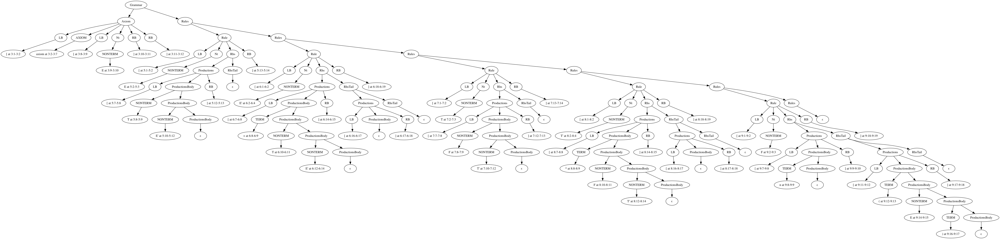

% Лабораторная работа № 2.3 «Синтаксический анализатор на основе
  предсказывающего анализа»
% 27 мая 2025 г.
% Александр Старовойтов, ИУ9-61Б

# Цель работы

Целью данной работы является изучение алгоритма построения таблиц
предсказывающего анализатора.

# Индивидуальный вариант

```
% аксиома
[axiom [E]]
% правила грамматики
[E    [T E']]
[E'   [+ T E'] []]
[T    [F T']]
[T'   [* F T'] []]
[F    [n] [( E )]]
```

# Реализация

## Неформальное описание синтаксиса входного языка

Грамматика описывающая грамматики.

## Лексическая структура

```
AXIOM ::= "axiom"
COMMENT ::= %.*
NONTERM ::= [A-Z]+'?
TERM ::= [^A-Z\[\]]+
LB ::= [
RB ::= ]
```

## Грамматика языка

```
Grammar -> Axiom Rules
Axiom -> LB AXIOM LB Nt RB RB
Rules -> Rule Rules
Rules -> ε
Rule -> LB Nt Rhs RB
Nt -> NONTERM
Rhs -> Productions RhsTail
RhsTail -> Productions RhsTail
RhsTail -> ε
Productions -> LB ProductionsBody RB
ProductionsBody -> ε
ProductionsBody -> TERM ProductionsBody
ProductionsBody -> NONTERM ProductionsBody
```

## Программная реализация

Таблица:

<!-- ENABLE LONG LINES -->

```
|                 | AXIOM | COMMENT | NONTERM                 | TERM                 | LB                    | RB | $ |
|-----------------+-------+---------+-------------------------+----------------------+-----------------------+----+---|
| Grammar         |       |         |                         |                      | Axiom Rules           |    |   |
| Axiom           |       |         |                         |                      | LB AXIOM LB Nt RB RB  |    |   |
| Rules           |       |         |                         |                      | Rule Rules            |    | ε |
| Rule            |       |         |                         |                      | LB Nt Rhs RB          |    |   |
| Nt              |       |         | NONTERM                 |                      |                       |    |   |
| Rhs             |       |         |                         |                      | Productions RhsTail   |    |   |
| RhsTail         |       |         |                         |                      | Productions RhsTail   | ε  |   |
| Productions     |       |         |                         |                      | LB ProductionsBody RB |    |   |
| ProductionsBody |       |         | NONTERM ProductionsBody | TERM ProductionsBody |                       | ε  |   |
```

```python
#!/usr/bin/env python3

import lexer
from lark import Token
from dataclasses import dataclass
from pprint import pprint
import uuid


TEXT = """
% аксиома
[axiom [E]]
% правила грамматики
[E    [T E']]
[E'   [+ T E'] []]
[T    [F T']]
[T'   [* F T'] []]
[F    [n] [( E )]]
"""

TABLE = {
    'Grammar': {'LB': ['Axiom', 'Rules']},
    'Axiom': {'LB': ['LB', 'AXIOM', 'LB', 'Nt', 'RB', 'RB']},
    'Rules': {'LB': ['Rule', 'Rules'], '$': []},
    'Rule': {'LB': ['LB', 'Nt', 'Rhs', 'RB']},
    'Nt': {'NONTERM': ['NONTERM']},
    'Rhs': {'LB': ['Productions', 'RhsTail']},
    'RhsTail': {'LB': ['Productions', 'RhsTail'], 'RB': []},
    'Productions': {'LB': ['LB', 'ProductionsBody', 'RB']},
    'ProductionsBody': {'NONTERM': ['NONTERM', 'ProductionsBody'],
                        'TERM': ['TERM', 'ProductionsBody'],
                        'RB': []},
}


@dataclass
class Node:
    uuid: str
    name: str
    children: list['Node']


def new_uuid() -> str:
    return "n"+str(uuid.uuid4()).replace('-', '')


def top_down_parse(tokens: list[Token], start: str, terminals: list[str], table: dict[str, dict[str, list[str]]]) -> Node:
    tokens.append(Token('$', '$'))
    derivation_tree: Node = Node(new_uuid(), start, list())
    mag = [('$', None), (start, derivation_tree)]
    token = tokens[0]
    top = None
    while True:
        top, top_node = mag[-1]
        if top == '$':
            break
        if top in terminals:
            if top == token.type:
                top_node.children.append(Node(new_uuid(), f"{token} at {token.line}:{token.column}-{token.end_line}:{token.end_column}", list()))
                mag.pop()
                tokens = tokens[1:]
                token = tokens[0]
            else:
                raise Exception(f'Error at {token.line}:{token.column}-{token.end_line}:{token.end_column}')
        elif top in table and token.type in table[top]:
            chain = table[top][token.type]
            chain = list(map(lambda t: (t, Node(new_uuid(), t, list())), chain))
            for _, node in chain:
                top_node.children.append(node)
            if not chain:
                top_node.children.append(Node(new_uuid(), 'ε', list()))
            mag.pop()
            mag += reversed(chain)
        else:
            raise Exception(f'Error at {token.line}:{token.column}-{token.end_line}:{token.end_column}')
    return derivation_tree


def get_dot(tree: Node) -> str:
    def get_dot_inner(node: Node) -> str:
        return f"{node.uuid} [label=\"{node.name}\"]\n" + \
            "".join(map(lambda child: f"{node.uuid} -> {child.uuid}\n", node.children)) + \
            (" { rank=same; " if len(node.children) > 1 else "") +\
            (" -> ".join(map(lambda child: f"{child.uuid}", node.children)) if len(node.children) > 1 else "")  + \
            (" [style=invis] }\n" if len(node.children) > 1 else "") + \
            "".join(map(get_dot_inner, node.children))

    return "digraph {\n" + \
        get_dot_inner(tree) + \
        "}\n"


def main():
    tokens = lexer.tokenize(TEXT)
    derivation_tree = top_down_parse(tokens, 'Grammar', ['$', 'LB', 'RB', 'AXIOM', 'NONTERM', 'TERM'], TABLE)
    print(get_dot(derivation_tree))


if __name__ == "__main__":
    main()
```

# Тестирование

Входные данные

```
% аксиома
[axiom [E]]
% правила грамматики
[E    [T E']]
[E'   [+ T E'] []]
[T    [F T']]
[T'   [* F T'] []]
[F    [n] [( E )]]
```

Вывод на `stdout`

```
digraph {
n19e85eb071c443829d04ca8748888507 [label="Grammar"]
n19e85eb071c443829d04ca8748888507 -> n83f9d19c6ac540dbaff92f8129ed6b3b
n19e85eb071c443829d04ca8748888507 -> n4a6bc06805644e04be8bfade7cc11236
 { rank=same; n83f9d19c6ac540dbaff92f8129ed6b3b -> n4a6bc06805644e04be8bfade7cc11236 [style=invis] }
n83f9d19c6ac540dbaff92f8129ed6b3b [label="Axiom"]
n83f9d19c6ac540dbaff92f8129ed6b3b -> ndf169f85e98246f5a3ee44e3b51f13ed
n83f9d19c6ac540dbaff92f8129ed6b3b -> nceda8b3bb9be40938a5aa0c90567086e
n83f9d19c6ac540dbaff92f8129ed6b3b -> na4ff0de470b24cfebc83e4e2f570264a
n83f9d19c6ac540dbaff92f8129ed6b3b -> n16e9a811b41245ce8c0256d2fa3a4773
n83f9d19c6ac540dbaff92f8129ed6b3b -> n61ee37cba43d4ec190e189a8dee55af1
n83f9d19c6ac540dbaff92f8129ed6b3b -> n044f80eb101b4eab8d8e748b7b64521e
...
```



# Вывод

В рамках данной лабораторной работы я изученил алгоритм построения таблиц
предсказывающего анализатора.
